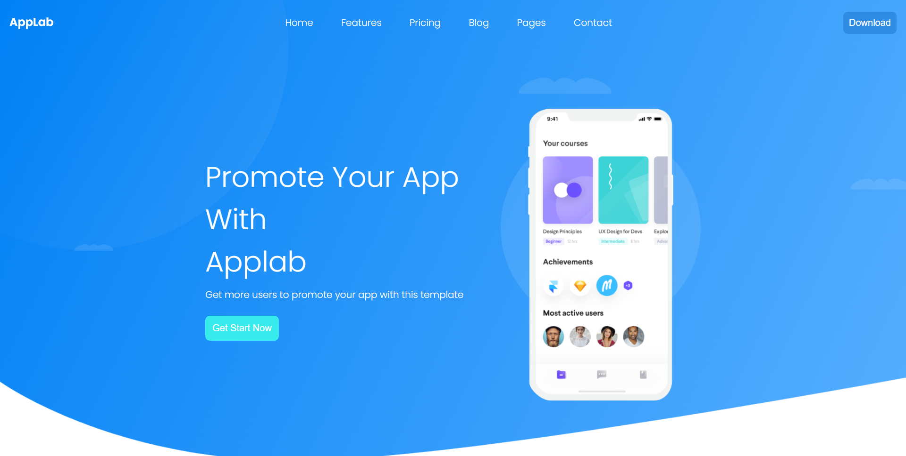

# RWD Website

RWD Website is a responsive landing page modeled after [Colorlib free Applab template](https://colorlib.com/wp/template/applab/). 

See the live version of [the RWD Website](https://domas-mo.github.io/task-html-and-css-rwd/)

**Main features**:
- HTML5
- CSS3
- RWD
- BEM
&nbsp;
 
## 💡 Technologies


&nbsp;
 
## 💿 Installation

The project uses [node](https://nodejs.org/en/) and [npm](https://www.npmjs.com/). Having them installed, type into the terminal: `npm i`.
&nbsp;

## 🤔 Solutions provided in the project

1. CSS files have been split according to three breakpoints:
- mobile;
- tablet;
- desktop;

2. Root slector has been used in global.css. This helps keep the code organized.
```
:root {
    /* font-color */
    --color-alfa: rgb(255, 255, 255);
    --color-beta: rgb(22, 22, 22);
}
```

3. Classes are named according to the BEM methodology.
```
<span class="header-nav__logo">
    
</span>
```

4. In project I use Flexbox and Grid. They are perfect way to lay out, align and distribute space among items in a container, even when their size is unknown or dynamic. They work together quite well.
&nbsp;

## 🙋‍♂️ Feel free to contact me

Find me on...

<p align="center">
	<a href="https://github.com/domas-mo"></a>
	<a href="https://www.linkedin.com/in/dominik-mo/"></a>
    <a href="mailto:dominik.mozdzen1@gmail.com"></a>
</p>
&nbsp;

## 👏 Thanks / Special thanks / Credits

- To my [Mentor - devmentor.pl](https://devmentor.pl/) - for providing me with this task and for code review.
- To [Colorlib](https://colorlib.com/wp/) for free templates.
